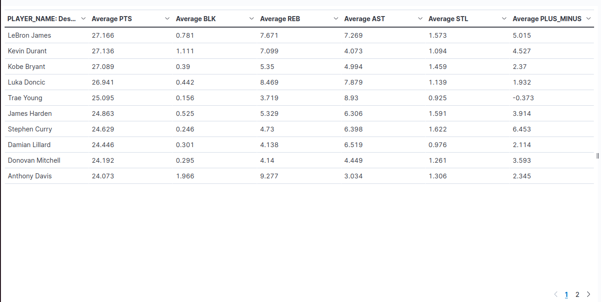

# Vizualizace dat - prezentace výsledků

## Vizualizace 1

### Average points scored by each team(all seasons)

## Vizualizace 2

### Statistics for all time 20 best scorers 

## Vizualizace 3

### Distribution of points scored all time by each team 

## Vizualizace 4

### Top 5 all time scoring games for best 25 players with responding field goal percentages

## Vizualizace 5

### Ration of games played for Los Angeles Lakers(top 25 lakers sorted by games played)

## Vizualizace 6

### Statistics of Giannis Antetokounmpo since entering the league

## Vizualizace 7

### Total rebounds distribution for each year across all teams in the league

## Vizualizace 8

### Average FG, FT, FG3 percentage all time for all teams across the league

